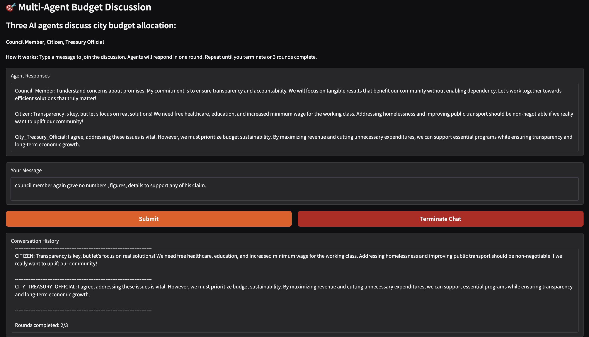
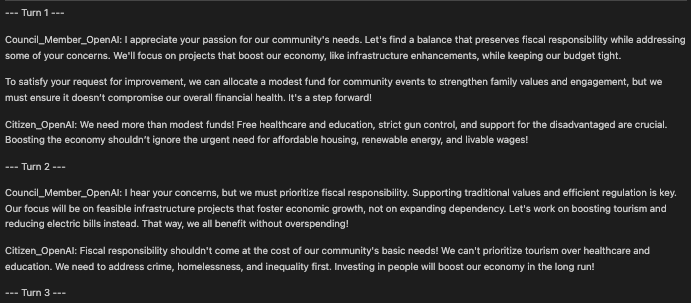

# Multimodal AI - Multi-Agent Conversation System

A sophisticated multi-agent conversation system that simulates realistic budget allocation discussions between political, citizen, and treasury representatives using AI agents powered by OpenAI's language models.

## Screenshots/Demo

### Group Chat



### Two way communication



## AI Concepts Learned

1. **Multi-Agent Systems** - Multiple autonomous agents with distinct personalities interact through shared message history
2. **Conversational AI** - Agents maintain context across turns and generate coherent responses
3. **System Prompts** - Instructions that define agent behavior and objectives
4. **Async Programming** - Non-blocking concurrent API calls for multiple agents using async/await
5. **Message Protocols** - Standardized TextMessage format with source attribution for agent communication
6. **Consensus Building** - Agents with opposing views reach compromise through dialogue
7. **Prompt Engineering** - Crafting detailed system messages to guide AI behavior
8. **Conversation Flow** - Round-based management with termination conditions and error handling

## Libraries Used

| Library                 | Purpose                            | Key Components                                                |
| ----------------------- | ---------------------------------- | ------------------------------------------------------------- |
| **pyautogen** (v0.10.0) | Multi-agent framework by Microsoft | `AssistantAgent`, `TextMessage`, `OpenAIChatCompletionClient` |
| **openai**              | OpenAI API client                  | GPT-4o-mini language model provider                           |
| **python-dotenv**       | Environment variable management    | `.env` file loading for API keys                              |
| **asyncio**             | Asynchronous I/O                   | Concurrent agent API calls with async/await                   |
| **isort** & **black**   | Code formatting                    | Import organization and style consistency                     |

## Project Files

| File            | Description                                                                    |
| --------------- | ------------------------------------------------------------------------------ |
| `two-way.py`    | 2-agent system (Politician, Citizen) - 4 turns, sequential responses           |
| `group-chat.py` | 3-agent system (Politician, Citizen, Treasury) - 3 rounds, consensus detection |
| `ui.py`         | Gradio web interface for human-in-the-loop interaction with 3 agents           |
| `prompt.py`     | System prompts for all agents and initial task context                         |
| `config.py`     | OpenAI API configuration and environment setup                                 |
| `helper.py`     | Utility functions for output formatting                                        |

### _NOTE_ - _Agent is not thread safe and agent maintains state between calls so do not pass entire conversation history._

This fix saved lot of tokens, api calls and $$$.


## Installation & Usage

### CLI Mode (Terminal)

```bash
# Create virtual environment
python3 -m venv venv
source venv/bin/activate

# Install dependencies
pip install -r requirements.txt

# Run two-agent conversation
python two-way.py

# Run three-agent conversation
python group-chat.py
```

### Web UI Mode (Gradio - Human-in-the-Loop)

```bash
# Activate virtual environment (if not already active)
source venv/bin/activate

# Launch web interface
python ui.py
```

Then open your browser to **http://localhost:7860**

#### Web UI Features:

- **Conversation History** (Top): Real-time display of all agent and human messages
- **User Message Input** (Bottom): Text box to submit messages to the agents
- **Submit Message Button**: Send your message and trigger agent responses
- **Start Round Button**: Begin a new round of agent discussion without human input
- **Terminate Chat Button**: Stop the conversation immediately
- **Reset Chat Button**: Clear history and start fresh conversation
- **Agent Response Display**: View the most recent agent outputs

## Requirements

- Python 3.9+
- OpenAI API key (stored in `.env` file)
- See `requirements.txt` for complete dependencies
